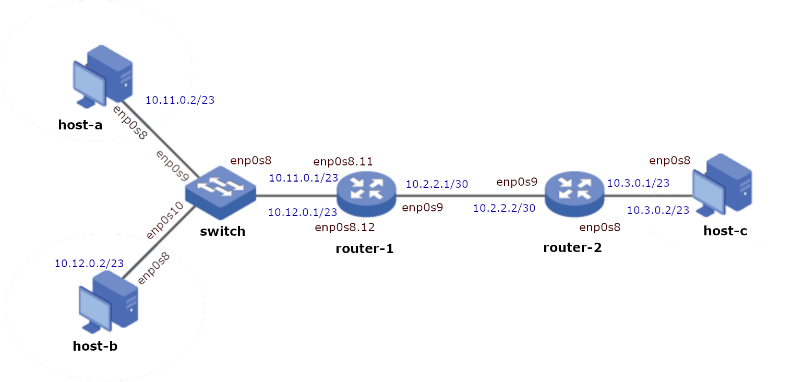
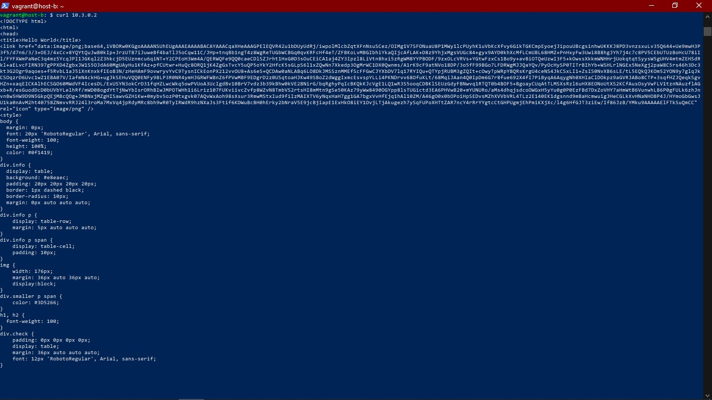
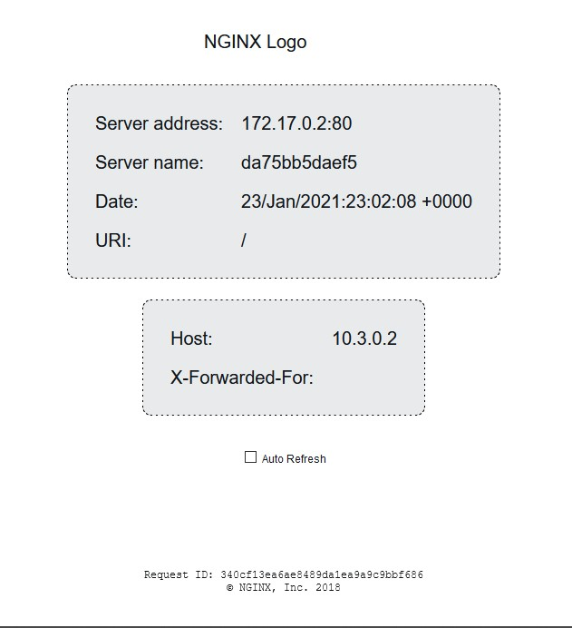

# DNCS-LAB

This repository contains the Vagrant files required to run the virtual lab environment used in the DNCS course.
```


        +-----------------------------------------------------+
        |                                                     |
        |                                                     |eth0
        +--+--+                +------------+             +------------+
        |     |                |            |             |            |
        |     |            eth0|            |eth2     eth2|            |
        |     +----------------+  router-1  +-------------+  router-2  |
        |     |                |            |             |            |
        |     |                |            |             |            |
        |  M  |                +------------+             +------------+
        |  A  |                      |eth1                       |eth1
        |  N  |                      |                           |
        |  A  |                      |                           |
        |  G  |                      |                     +-----+----+
        |  E  |                      |eth1                 |          |
        |  M  |            +-------------------+           |          |
        |  E  |        eth0|                   |           |  host-c  |
        |  N  +------------+      SWITCH       |           |          |
        |  T  |            |                   |           |          |
        |     |            +-------------------+           +----------+
        |  V  |               |eth2         |eth3                |eth0
        |  A  |               |             |                    |
        |  G  |               |             |                    |
        |  R  |               |eth1         |eth1                |
        |  A  |        +----------+     +----------+             |
        |  N  |        |          |     |          |             |
        |  T  |    eth0|          |     |          |             |
        |     +--------+  host-a  |     |  host-b  |             |
        |     |        |          |     |          |             |
        |     |        |          |     |          |             |
        ++-+--+        +----------+     +----------+             |
        | |                              |eth0                   |
        | |                              |                       |
        | +------------------------------+                       |
        |                                                        |
        |                                                        |
        +--------------------------------------------------------+


```

# Requirements
 - Python 3
 - 10GB disk storage
 - 2GB free RAM
 - Virtualbox
 - Vagrant (https://www.vagrantup.com)
 - Internet

# How-to
 - Install Virtualbox and Vagrant
 - Clone this repository
`git clone https://github.com/fabrizio-granelli/dncs-lab`
 - You should be able to launch the lab from within the cloned repo folder.
```
cd dncs-lab
[~/dncs-lab] vagrant up
```
Once you launch the vagrant script, it may take a while for the entire topology to become available.
 - Verify the status of the 4 VMs
 ```
 [dncs-lab]$ vagrant status                                                                                                                                                                
Current machine states:

router                    running (virtualbox)
switch                    running (virtualbox)
host-a                    running (virtualbox)
host-b                    running (virtualbox)
```
- Once all the VMs are running verify you can log into all of them:
`vagrant ssh router`
`vagrant ssh switch`
`vagrant ssh host-a`
`vagrant ssh host-b`
`vagrant ssh host-c`

# Assignment
This section describes the assignment, its requirements and the tasks the student has to complete.
The assignment consists in a simple piece of design work that students have to carry out to satisfy the requirements described below.
The assignment deliverable consists of a Github repository containing:
- the code necessary for the infrastructure to be replicated and instantiated
- an updated README.md file where design decisions and experimental results are illustrated
- an updated answers.yml file containing the details of your project

## Design Requirements
- Hosts 1-a and 1-b are in two subnets (*Hosts-A* and *Hosts-B*) that must be able to scale up to respectively 479 and 255 usable addresses
- Host 2-c is in a subnet (*Hub*) that needs to accommodate up to 348 usable addresses
- Host 2-c must run a docker image (dustnic82/nginx-test) which implements a web-server that must be reachable from Host-1-a and Host-1-b
- No dynamic routing can be used
- Routes must be as generic as possible
- The lab setup must be portable and executed just by launching the `vagrant up` command

## Tasks
- Fork the Github repository: https://github.com/fabrizio-granelli/dncs-lab
- Clone the repository
- Run the initiator script (dncs-init). The script generates a custom `answers.yml` file and updates the Readme.md file with specific details automatically generated by the script itself.
  This can be done just once in case the work is being carried out by a group of (<=2) engineers, using the name of the 'squad lead'. 
- Implement the design by integrating the necessary commands into the VM startup scripts (create more if necessary)
- Modify the Vagrantfile (if necessary)
- Document the design by expanding this readme file
- Fill the `answers.yml` file where required (make sure that is committed and pushed to your repository)
- Commit the changes and push to your own repository
- Notify the examiner (fabrizio.granelli@unitn.it) that work is complete specifying the Github repository, First Name, Last Name and Matriculation number. This needs to happen at least 7 days prior an exam registration date.

# Notes and References
- https://rogerdudler.github.io/git-guide/
- http://therandomsecurityguy.com/openvswitch-cheat-sheet/
- https://www.cyberciti.biz/faq/howto-linux-configuring-default-route-with-ipcommand/
- https://www.vagrantup.com/intro/getting-started/


# Design
First of all I ran the dcns-init script, which provided the following host numbers to support for each subnet.
- 479 Hosts for the subnet Hosts-A
- 255 Hosts for the subnet Hosts-B
- 348 Hosts for the subnet Hub

Considering the need to reserve the two broadcast and network addresses for their respective functions, as explained below there is in all the three subnets the need to use nine bits to distinguish the various hosts.

# Network structure

The topology of the network required four different networks.
To make them operative the first task is calculating netmasks and ip addresses of the connected machines.

The **Hosts-A** subnet must support 479 different addresses to which add the router address, network address and broadcast address; therefore, 482 different addresses are needed, which need 9 bits to be represented.
How the (log<sub>2</sub>482 = 8,91) formula say (non-whole numbers had to be aproximated upwards).
I opted to give to this subnet the network address ```10.11.0.0/23``` and the netmask ```255.255.254.0```.

In **Hosts-B** and **Hub** subnets the situation is basically the same becouse in both subnets considering the addresses of router, network and broadcast, the number of required addresses is over 256 and under 512. So even here it is convenient to use 9 bit to rappresent the different addresses, how the formula log<sub>2</sub>512 = 9 say.
So I choose Hosts-B and Hub to have respectively ```10.12.0.0/23``` and ```10.3.0.0``` IP addresses. For both the netmask is ```255.255.254.0```.

Note that host-a and host-b are in two different subnet but they are connected to the same switch and router. So I had to create two VLANs, one for every subnet:
1. The VLAN with tag 11 managed the network ```10.11.0.0```
2. The VLAN with tag 12 managed the network ```10.12.0.0```

The **broadcast_router-inter** subnet connect the two routers together, so only four addresses are needed. Doing the same calcolous of the previus cases log<sub>2</sub>4 = 2 it's possible to se that only two bits are needed.
I choose to assign ```10.2.2.0/30``` as network address and ```255.255.255.252```.


## changes to the Vagrantfile
To prevent some errors I added ```config.ssh.connect_timeout = 25``` and ```config.vm.boot_timeout=700```. I also added  ```config.ssh.insert_key = false``` to make the creation of virtual machines faster avoiding unuseful operations.
Anoter change I made in the Vagrantfile is to double the memory of host-c (modifying the voice ```vb.memory```) to make it capable of running the docker image dustnic82/nginx-test and implementing the web-server.
For each virtual machine I have added a script file to run at startup (after *vagrant up*) to configure it according to the requirements.
Finally I renamed the internal networks to Hub, Hosts-B and Hosts-A according to the requirements.

# Scripts executed by VM
## host-a
```
ip addr flush dev enp0s8 
# SET IP
sudo ip a add 10.11.0.2/23 dev enp0s8
sudo ip link set dev enp0s8 up
#  ROUTING TABLE
sudo ip route add default via 10.11.0.1
```
First of all I use ip addr flush command to clear IP address of the interface without bringing it down or restarting network services; this prevent errors in case of resume, it isn't really necessary.
Later i use the ip command to set the correct IP and enabling the interface.
Finally I insert a row in the routing table to direct all traffic to the router (note that this operation blocks the machine's internet access).

## host-b
```
ip addr flush dev enp0s8
#  SET IP
sudo ip a add 10.12.0.2/23 dev enp0s8
sudo ip link set dev enp0s8 up

#  ROUTING TABLE
sudo ip route add default via 10.12.0.1
```
Host-b has the same configuration of host-a.

## host-c
```
ip addr flush dev enp0s8
echo "_Start Docker installation_"

sudo apt update
curl -fsSL  https://download.docker.com/linux/ubuntu/gpg | sudo apt-key add -
add-apt-repository "deb  [arch=amd64] https://download.docker.com/linux/ubuntu $(lsb_release -cs)  stable"
sudo apt install -y  docker.io
docker pull  dustnic82/nginx-test

#  SET IP
sudo ip a add 10.3.0.2/23 dev enp0s8
sudo ip link set dev enp0s8 up

#  ROUTING TABLE
sudo ip route add default via 10.3.0.1  

echo "_Run Docker_"
sudo docker run --rm -it -d -p 80:80 --name web-server dustnic82/nginx-test  


```
Host-c has the same configuration of host-a and host-b, but also a big amount of code to install and run Docker.
Note that the piece of code that installs Docker must be before the one that sets the routing table because after it, it's no longer possible to access the internet (and dowload the necessary files).
There are also some ```echo``` command to make it easier to understand the output in the command line.
Also note that some warnings are printed during execution but they just remind you not to use the output of apt in the script, so they are fully respected and there is no problem.

## switch
```
export DEBIAN_FRONTEND=noninteractive
apt-get update
apt-get install -y tcpdump
apt-get install -y openvswitch-common openvswitch-switch apt-transport-https ca-certificates curl software-properties-common

sudo ovs-vsctl add-br bridge
sudo ovs-vsctl  add-port bridge enp0s8  
sudo ovs-vsctl  add-port bridge enp0s9 tag=11
sudo ovs-vsctl  add-port bridge enp0s10 tag=12

#  START PORTS
sudo ip link set enp0s8 up
sudo ip link set enp0s9 up
sudo ip link set enp0s10 up
```
The first few lines are for installing openvswitch and tcpdump. In the following lines, instead, openvswitch is used to create a bridge (called bridge) to which three ports are added: two access ports (enp0s9 belonging to the VLAN with tag 11, and enp0s10 belonging to the VLAN with tag 11) and a trunk port (enp0s8, that as trunk port can carry the traffic of different VLANs across him).
Finally, as in all other virtual machines, the various ports are activated.
During the implementation the command ```ovs-vsctl list-br``` has been useful for understand what was happening.

## router-1
```
ip addr flush dev enp0s8 
ip addr flush dev enp0s9 
#  SET IP and VLAN
sudo ip a add 10.2.2.1/30 dev enp0s9
sudo ip link set dev enp0s9 up

sudo ip link set dev enp0s8 up


sudo ip link add link enp0s8 name  enp0s8.11 type vlan id 11
sudo ip addr add 10.11.0.1/23 dev enp0s8.11

sudo ip link add link enp0s8 name  enp0s8.12 type vlan id 12
sudo ip addr add 10.12.0.1/23 dev enp0s8.12

#  active subinterfaces
sudo ip link set enp0s8.11 up
sudo ip link set enp0s8.12 up

#  ROUTING to host-c
sudo ip route add 10.3.0.0/23 via 10.2.2.2 dev enp0s9

#  attivo ip forwarding
sudo sysctl net.ipv4.ip_forward=1
```
First of all I use ip addr flush command to clear IP address of the interfaces without bringing them down or restarting network services; this prevent errors in case of resume, it isn't really necessary.
As in all other virtual machines, the various ports are activated using ```ip link set dev PORT up```.
Like in the other machines with ``` ip a(ddress) add IP dev PORT```  I set the correct IP on the port.
Then I created a subinterface for each of the two vlan with the relative tag and I added an IP to it; I activated the new subinterface as if they were true.
Then I added a row in the routing table to reach host-c through router-2.
In the end I enabled the IP forwarding.

## router-2
```
ip addr flush dev enp0s8
ip addr flush dev enp0s9

#  SET IP
#  between routers
sudo ip a add 10.2.2.2/30 dev  enp0s9
sudo ip link set dev enp0s9 up
#  to host-c
sudo ip a add 10.3.0.1/23 dev enp0s8
sudo ip link set dev enp0s8 up

#  ROUTING to vlans
sudo ip route add default via 10.2.2.1 dev enp0s9

#  active ip forwarding
sudo sysctl net.ipv4.ip_forward=1
```
First of all I use ip addr flush command to clear IP address of the interfaces without bringing them down or restarting network services; this prevent errors in case of resume, it isn't really necessary.
Later I added an IP to network card interfaces and bringed them up.
Then I added a row in the routing table to reach vlans through router-1.
In the end I enabled the IP forwarding.

# Final results
To test if the scripts executed actually have led to hosts with the desired characteristics, after running the *vagrant up* command, I connected (using *vagrant ssh host-a/b*) to the client hosts (host-a or host-b) and checked if the web-server on host-c was active with the *curl* command.

To more easily understand the content of the answer, I saved it to an html file which I subsequently opened with a browser.

Receiving an html response like this implies that the routing works correctly in both directions, as does the web-server contained in host-c.